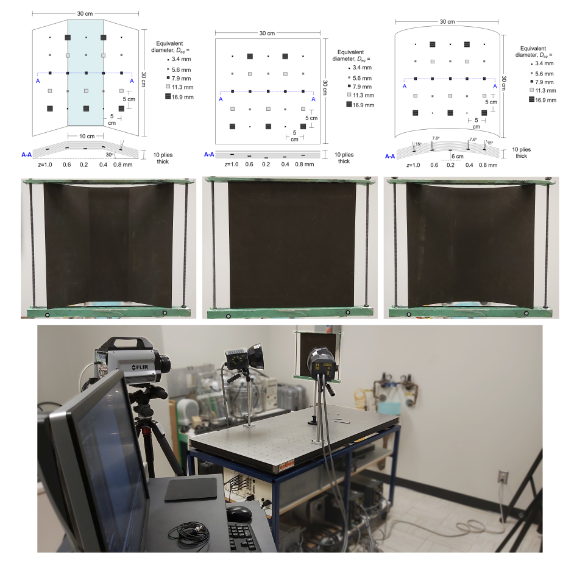

<!-- PROJECT LOGO -->
 

  

  <h3 align="center">PHM-IRNET</h3>
  <h4 align="center">Self-Training Thermal Segmentation Approach for Thermographic Inspection of Industrial Components</h4>

   
   
  

Automating thermographic analysis for industrial and construction inspection is one of the essential aspects of NDT 4.0 in industrial transformation. Thermal segmentation is a preliminary step for characterizing a component's heat signatures by detecting and extracting thermal patterns. Manual segmentation of areas with distinctive thermal patterns is a time-consuming task that consecutively can increase the operation cost. Thus, automatic thermal segmentation can significantly assist companies in avoiding possible misinterpretation and decrease the operation cost. Due to the lack of enough labeled thermal images to train deep neural networks and the fact that, by nature, thermal abnormalities may have non-uniform patterns and form in different shapes and sizes, training a deep neural network can be a challenging task. Moreover, selecting common features can cause possible convergence onto dependency toward specific shapes or patterns. Thus, this paper proposes a self-training thermal segmentation method involving a novel process pipeline for using labeled and unlabeled data for training the presented deep-learning model. The method uses an unsupervised approach for predicting the ground truth in case of unlabeled data before passing the data to the secondary model for segmentation. For this paper, three experiments are conducted to evaluate the method's performance and provide a comparative analysis of the most recent techniques. The first experiment uses a simulated inspection designed using COMSOL software. The second experiment employs several plate inspections in isolated environments. Finally, the third experiment uses thermal images acquired during an actual inspection of the piping structure and aerospace components

  

  

### Datasets

For downloading the dataset of plate inspection simulation use the following link, 

<a href="https://data.mendeley.com/datasets/ms5x8hnmg4/draft?a=c8acdc50-2f37-42e4-a86c-73e2bbed3a82">Mendeley Data</a>

### Results and Experiments

For reviewing the results, you can go to our repo in Comet.ml website,

<a href="https://www.comet.com/parham/thermal-segmentor/view/new/experiments">Comet.ml</a>

### Plate Simulation

For this dataset, a scenario was simulated using COMSOL software where multiple plates with different materials and shapes were heated during a plate inspection using an external stimulation unit. The plates contain various defects of different sizes and shapes, placed in different depths. The thermal images of the heating and cooling process were exported during the execution. The dataset contains a total of 12 different experiments on plates with three different shapes and five materials. Figure 3 shows sample thermal images of simulated experiment.

  

### Plate Inspection

For this section, two datasets acquired while conducting active thermography of plates with different shapes and defect patterns were employed. The datasets are used to evaluate the proposed algorithm with real cases conducted in an isolated environment. For this study, the thermal images are labeled using GIMP software with three main classes: (a) surface defect, (b) defect, and (c) background.

  

### Real Scenarios

For this dataset, two experiments were conducted for acquired thermal images of real case inspections. GIMP software is employed to label thermal images with three main classes: (a) surface defect, (b) defect, and (c) background. For the first experiment, the inspection was conducted using an indoor piping setup prepared with different carbon steel pipes wrapped with wool isolation. The pipes are wrapped using a wool isolation layer, and part of the isolation is defected manually to create surface defects. During the experiment, the setup operated while pumping hot oil into the pipes. A FLIR T650sc camera was employed to collect thermal images. Thermal images were cropped to present the region of interest better. 

  

### Team
* Designed and Developed by: Parham Nooralishahi, PhD. candidate @ Computer and Electrical Engineering Department, Université Laval
* Supervisor: Professor Xavier Maldague
* Industrial Supervisor: Dr. Fernando Lopez
* Program: Doctorate in Electrical Engineering
* University: Université Laval

### Built With
* [PyTorch](https://pytorch.org/)
* [Pillow](https://pypi.org/project/Pillow/)
* [pytorch-ignite](https://github.com/pytorch/ignite)

## Contact
Parham Nooralishahi - parham.nooralishahi.1@ulaval.ca | [@phm](https://www.linkedin.com/in/parham-nooralishahi/)  

## Acknowledgements
We acknowledge the support of the Natural Sciences and Engineering Council of Canada (NSERC), CREATE-oN DuTy Program [funding reference number 496439-2017], DG program, the Canada Research Chair in Multipolar Infrared Vision (MIVIM), and the Canada Foundation for Innovation. The authors thanks Dr. Clemente Ibarra Castanedo for sharing the dataset used in part of this study. Also, the authors want to thank Marcos Paulo Souza for supporting the data acquisition by permitting the use of the piping setup that he prepared and maintained. Special thanks to TORNGATS company for providing the required equipment and support for performing the experiments.

